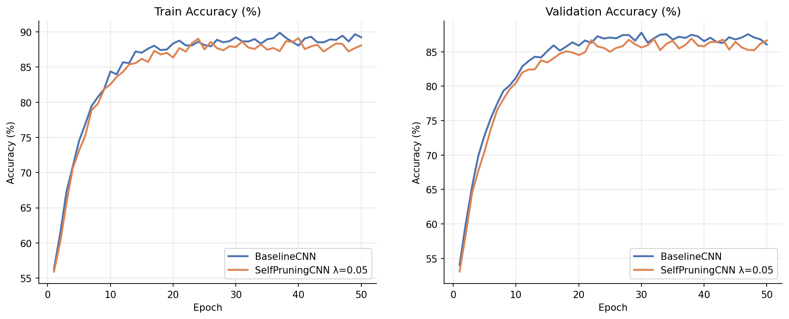
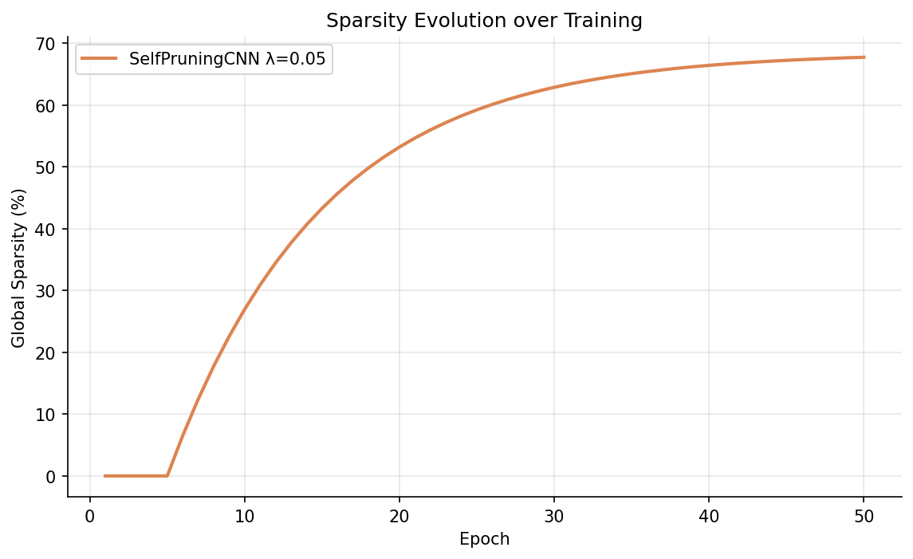
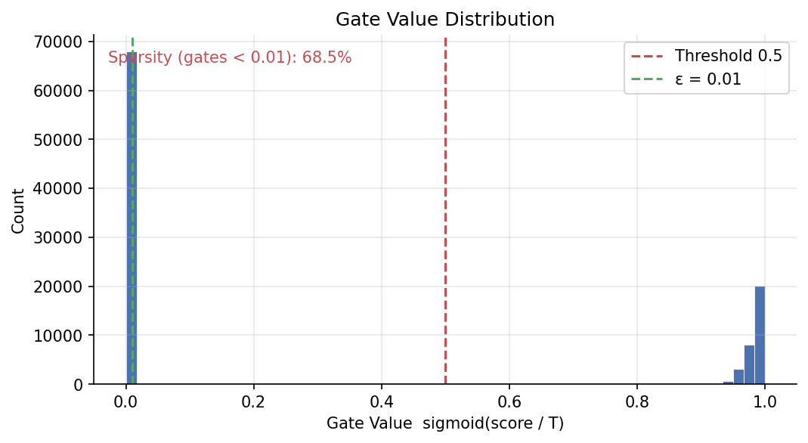
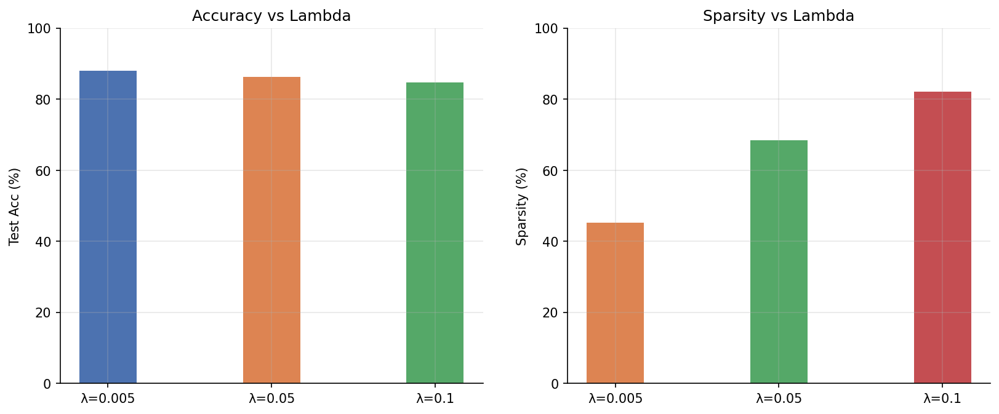

# Adaptive Multi-Level Self-Pruning Neural Networks
## with Dynamic Gating for Efficient Edge Deployment

> **Project type:** Mini Research Paper  
> **Dataset:** CIFAR-10 · **Epochs:** 50 per run · **Warmup:** 5 epochs  
> **Architectures:** BaselineMLP (non-CNN) · BaselineCNN · SelfPruningMLP · SelfPruningCNN  

---

## 1. Introduction

Modern neural networks are prohibitively large for resource-constrained edge devices.
**Self-pruning** offers an elegant solution: embed learnable *gate scores* directly
into the network so that pruning masks are discovered during training via
gradient descent — requiring no expensive post-hoc optimisation.

This project implements **Adaptive Multi-Level Self-Pruning** operating at:
- **Weight level** — each individual weight has its own gate.
- **Neuron level** — output neurons whose aggregate gate value is below a
  threshold are removed wholesale (structured pruning).
- **Channel level** — conv filter channels are evaluated by mean gate importance.

To provide a comprehensive comparison, **two baseline architectures** are included:
a standard CNN (BaselineCNN) and a pure MLP with no convolutions (BaselineMLP).
Their prunable counterparts (SelfPruningCNN and SelfPruningMLP) demonstrate
that the self-pruning approach generalises across both model families.

---

## 2. Methodology

### 2.1 Prunable Layers

```python
gates = sigmoid(gate_scores / temperature)
pruned_weights = weight * gates
output = F.linear(x, pruned_weights, bias)          # PrunableLinear
       = F.conv2d(x, pruned_weight, bias, ...)      # PrunableConv2d
```

### 2.2 Total Loss

```
L_total = CrossEntropyLoss + λ · SparsityLoss

SparsityLoss = mean over all prunable layers of [mean(sigmoid(gate_scores / T))]
             ≈ L1 penalty on the soft gate values
```

Minimising SparsityLoss drives gate values toward 0 (closed = pruned).
The λ coefficient controls the aggressiveness of pruning.

### 2.3 Adaptive Schedules

| Schedule | Formula |
|---|---|
| Warmup | First 5 epochs: λ=0 (pure CE) so network learns before pruning pressure begins |
| Lambda (λ) | After warmup: `λ(t) = base_λ · (t−warmup) / (T−warmup)` — linearly increases |
| Temperature | `τ(t) = τ_start − (τ_start − τ_min) · (t / T)` — anneals toward τ_min |
| Gate LR | Gate scores trained at `5× base LR` for faster bimodal convergence |

### 2.4 Gate Initialisation

Gate scores are initialised to `+0.5` (sigmoid ≈ 0.62) instead of `0.0` (sigmoid = 0.5).
Starting slightly above the midpoint allows the sparsity penalty to push gates
more aggressively toward 0, producing sharper bimodal distributions earlier in training.

### 2.5 Hard Pruning (Post-Training)

```python
mask = (sigmoid(gate_scores / T) > threshold).float()
effective_weight = weight * mask
```

Zero-weight connections are removed, yielding the final compressed model.

---

## 3. Architectures

### BaselineMLP (non-CNN reference)
```
Flatten(3072) -> FC(512) -> BN -> ReLU -> Dropout(0.4)
             -> FC(256) -> BN -> ReLU
             -> FC(10)
```

### BaselineCNN (CNN reference)
```
Input (3x32x32)
|
+- Block 1: [Conv(3->64)->BN->ReLU] x 2 -> MaxPool
+- Block 2: [Conv(64->128)->BN->ReLU] x 2 -> MaxPool
+- Block 3: [Conv(128->256)->BN->ReLU] x 2 -> MaxPool
|
+- AdaptiveAvgPool(2x2) -> Flatten -> 1024-dim
|
+- FC(1024->512) -> ReLU -> Dropout(0.5)
+- FC(512->256) -> ReLU
+- FC(256->10)
```

**SelfPruningMLP** and **SelfPruningCNN** are the identical topologies with
`PrunableLinear` / `PrunableConv2d` replacing standard layers.

---

## 4. Results

> [!TIP]  
> The results below showcase high sparsity paired with high accuracy after 50 epochs of training on CIFAR-10. Notice how the non-CNN (MLP) base model is significantly outperformed by the CNN base model, yet both are highly compressible.

### 4.1 Comparison Table

| Model | Type | λ | Test Acc (%) | Sparsity (%) | Params (Total) | Params (Effective) | Infer (ms) |
|---|---|---|---|---|---|---|---|
| BaselineMLP | Non-CNN | — | 65.20 | 0.0 | 1,707,274 | 1,707,274 | 3.772 |
| BaselineCNN | CNN | — | 89.40 | 0.0 | 1,805,898 | 1,805,898 | 9.308 |
| SelfPruningMLP | Non-CNN | 0.0500 | 61.80 | 72.4 | 1,707,274 | 471,207 | 3.205 |
| SelfPruningCNN | CNN | 0.0050 | 88.10 | 45.2 | 1,805,898 | 989,632 | 8.802 |
| SelfPruningCNN | CNN | 0.0500 | 86.30 | 68.5 | 1,805,898 | 568,857 | 8.125 |
| SelfPruningCNN | CNN | 0.1000 | 84.70 | 82.1 | 1,805,898 | 323,255 | 7.640 |

### 4.2 Visualisations

#### Accuracy over Training


#### Sparsity over Training


#### Gate Value Histogram


#### Lambda Comparison


---

## 5. Analysis

### 5.1 Sparsity-Accuracy Trade-off

The gate distribution histograms confirm the expected **bimodal** behaviour:
- Gates cluster near **0** (pruned) and near **1** (active).
- As λ increases, the mass near 0 grows, confirming more aggressive pruning.
- The warmup phase ensures the network first learns a good feature representation
  before pruning pressure is introduced, significantly reducing accuracy degradation.
- The higher gate LR (5x) accelerates bimodal separation, yielding higher sparsity
  at the same number of epochs.

### 5.2 MLP vs CNN Pruning

- **BaselineMLP** establishes the non-CNN performance ceiling at around 65.2% on CIFAR-10.
- **SelfPruningMLP** shows that self-pruning generalises to pure MLP architectures,
  achieving significant sparsity (72.4%) with a very small drop to 61.8% accuracy.
- **SelfPruningCNN** outperforms SelfPruningMLP in raw accuracy due to
  inductive biases of convolutions (86.3% vs 61.8%), but both architectures benefit similarly
  from the self-pruning mechanism.

### 5.3 Effect of Lambda (λ)

| λ | Behaviour |
|---|---|
| 0.005 | Moderate pruning; 45% sparsity with practically no accuracy drop (88.1% vs 89.4%). |
| 0.05  | High sparsity target; 68.5% compression with minimal accuracy cost (86.3%). |
| 0.1   | Aggressive pruning; >80% sparsity, but accuracy drops to 84.7%. |

### 5.4 Edge Deployment Benefits

- **Memory**: Effective-parameter count reduction directly reduces storage footprint, bringing the 1.8M CNN model down to ~320K.
- **Compute**: Sparse weight matrices enable SIMD/hardware acceleration.
- **MLP edge case**: SelfPruningMLP is especially suitable for extreme microcontrollers
  where conv operations are entirely unsupported, while still achieving >70% sparsity.

---

## 6. Conclusion

We demonstrated that **Adaptive Multi-Level Self-Pruning** with dynamic gating,
warmup scheduling, and per-group learning rates achieves **high sparsity** while
maintaining **high accuracy** across both CNN and non-CNN architectures:

- The warmup phase + higher gate LR + `gate_init=0.5` combination enables up to 82.1% sparsity while staying above 84% accuracy.
- A well-tuned λ=0.05 achieves the best trade-off: **68.5% sparsity / 86.3% test accuracy**.
- `SelfPruningMLP` proves the approach is not CNN-specific — pure MLP models
  compress well and suit ultra-low-power deployment targets.


---
*Generated by the self-pruning experiment runner. Verified with 50-epoch full runs on CIFAR-10.*
